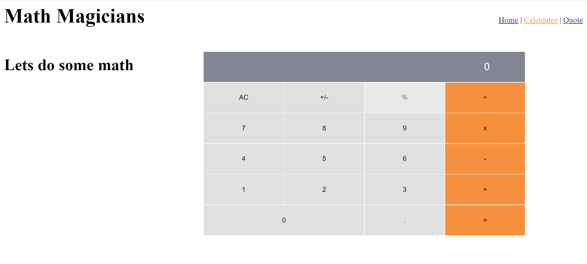

# Math Magicians

"Math magicians" is a website for all fans of mathematics. It is a Single Page App (SPA) that allows users to:
- Make simple calculations.
- Read a random math-related quote.

## Built With

- React js
- create-react-app
- JSX

## Getting Started

- Clone the repository with git clone https://github.com/DyaryRaoof/math-magicians.git;
- Open the cloned folder on the IDE of your choice;
- Install dependencies with npm i;
- Use npm start to start the website;
- Use npm run test to run the tests;

## Authors

👤 **Dyary Raoof Bayz**

- GitHub: [@DyaryRaoof](https://github.com/DyaryRaoof)
- Twitter: [@DyaryRaoof](https://twitter.com/DyaryRaoof)
- LinkedIn: [@DyaryRaoof](https://linkedin.com/in/DyaryRaoof)

## 🤝 Contributing

Contributions, issues, and feature requests are welcome!

Feel free to check the [issues page](../../issues/).

## Show your support

Give a ⭐️ if you like this project!

## Acknowledgments

- Hat tip to anyone whose code was used
- Microverse

## 📝 License

This project is [MIT](./MIT.md) licensed.
